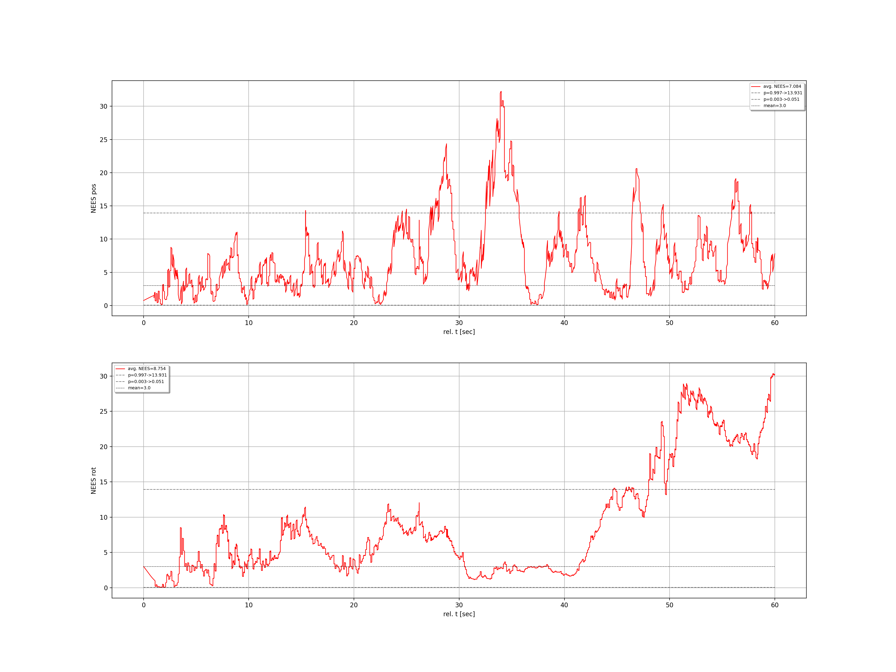

# Trajectory Evaluation

The class `TrajectoryEvaluation` associates to trajectories given by a filename to their CSV-file (estimated and ground-truth), associates their timestamps, aligns them according to a specified scheme, and computes the absolute trajectory error (ATE) and the normalized estimation error square (NEES) given the uncertainty of the estimates trajectory and the ATE. 
The results can be plotted and will be saved as `EvaluationReport`.

The CSV-file of the estimated trajectory must contain the pose uncertainty (`CSVFormat.PoseWithCov`). For the file format please refer to the [csv2dataframe]() package and the `CSVFormat.py` . 

## Dependencies

* [timestamp_association]()
* [trajectory]()
* [csv2dataframe]()
* [ros_csv_formats]()

## Examples

Please refer to the unit-test section in `TrajectoryEvaluation.py`.

### position error plot

### Pose error plot

### Pose NEES plot

## Credits

The classes `AbsoluteTrajectoryError` and `SpatialAlignment` of the  package `trajectory_evaluation` are based on the preliminary work of the  [Robotics and Perception Group, ETH Zurich](http://rpg.ifi.uzh.ch/index.html).

1) From ETH Zurich: [rpg_trajectory_evaluation](https://github.com/uzh-rpg/rpg_trajectory_evaluation) released by Zichao Zhang, Davide Scaramuzza: A Tutorial on Quantitative Trajectory Evaluation for Visual(-Inertial) Odometry, IEEE/RSJ Int. Conf. Intell. Robot. Syst. (IROS), 2018.

## License

Software License Agreement (GNU GPLv3  License), refer to the LICENSE file.

*Sharing is caring!* - [Roland Jung](https://github.com/jungr-ait)  
